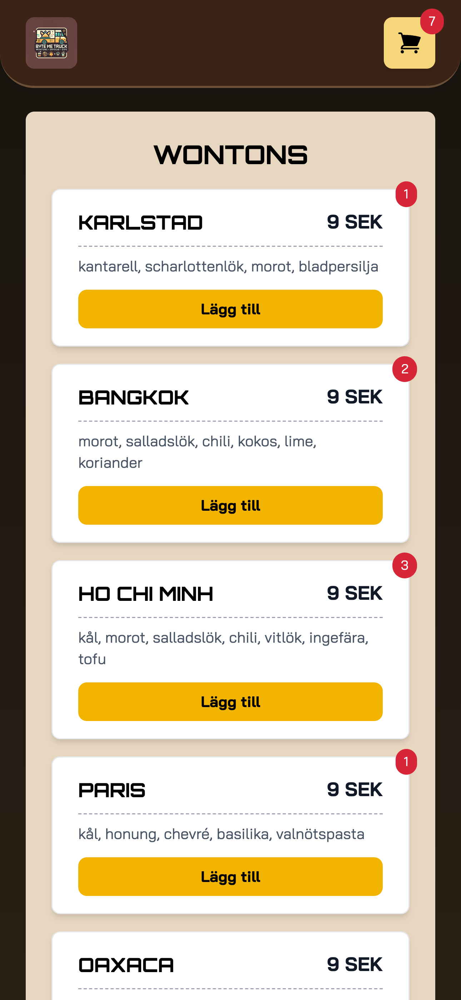
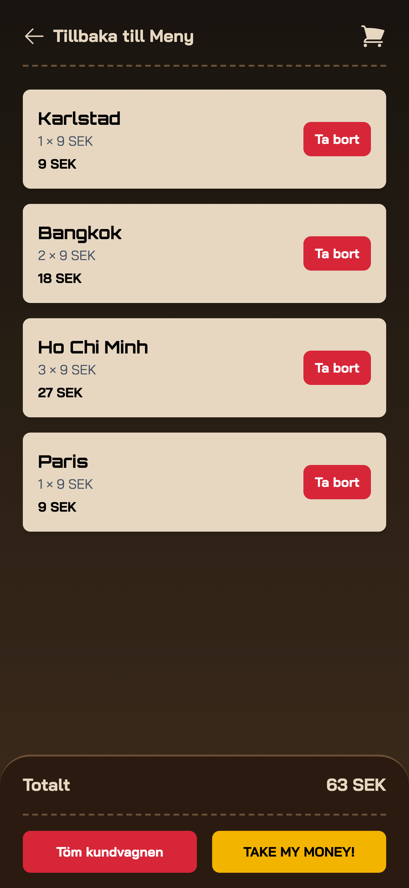
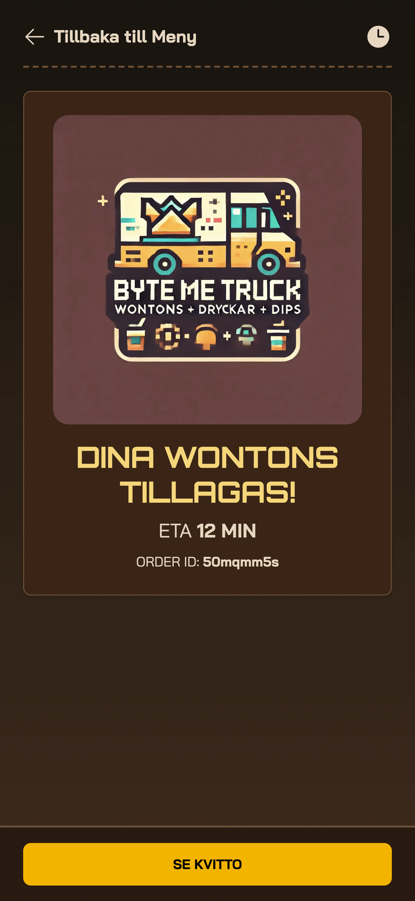
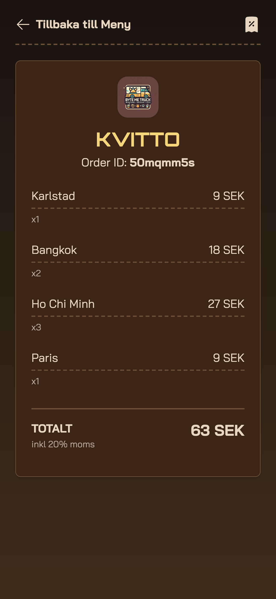

# Byte Me Truck – Wontons so good, even your API requests will come back for more.

## Description

Byte Me Truck is a futuristic and slightly chaotic food truck where wontons, drinks, and dips collide in a
high-tech street food fantasy. Whether you’re here for a crispy Karlstad wonton or a Sweet Chili dip that makes your API
rate limit cry, we’ve got you covered.

## Tech Stack

### **Frontend**

- **React 19** – The latest and greatest for our high-performance food ordering UI
- **TypeScript** – Because type safety is like food safety: important
- **Vite** – Lightning-fast dev environment

### **Styling & UI**

- **Tailwind CSS v4** – Sleek, modern, and no more writing custom CSS
- **@heroicons/react** – Beautiful icons that scream `We know what we're doing`
- **clsx** – Because conditional classNames shouldn’t be a headache

### **State Management**

- **Redux Toolkit & RTK Query** – Keeping track of your cart like a pro
- **React Redux** – So your wontons persist even when you navigate away

### **Routing**

- **React Router v7** – Seamless page navigation

### **Backend & Deployment**

- **AWS-Hosted API** – Handles orders with the efficiency of a Michelin-starred DevOps Engineer

## Setup

### Clone the repo

```sh
git clone https://github.com/neurothrone/byte-me-truck.git
cd byte-me-truck
```

### Install Dependencies

```sh
npm install
```

### Configure Environment Variables

Create a `.env` file in the root directory and configure:

```text
VITE_API_HEADER_KEY=your-api-header-key
VITE_API_URL=https://your-api-url.com
VITE_API_KEY=your-api-key
VITE_API_TENANT_ID=your-tenant-id
```

### Start the App

```sh
npm run dev
```

## Images

### Mobile View (iPhone 14 Pro Max)

#### Menu Page



#### Cart Page



#### Order Page



#### Receipt Page


